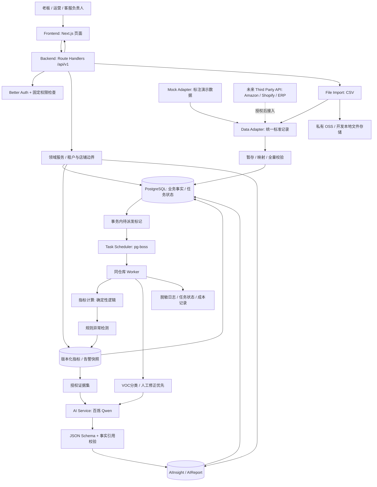

# 开发规则与技术架构

版本：v1.0 · 2026-09-11。状态：产品与工程规格；应用尚未开发。P0为本次定义的开发范围，P1/P2只作规划。

# 开发执行规则

本文件连同01—10是Coding Agent的开发合同。目录、技术栈及任务优先级按下文执行；当前用户要求仅完成设计，本文不构成“现在开始编码”的指令。

## 必须遵守的16条规则

1. Coding Agent不得擅自修改产品范围。P0以01、03、09的明确标注为准；规格中的未来架构不代表已授权开发。
2. 不得擅自更换技术栈。使用本文件指定的唯一选型；兼容性问题记录证据和最小修订请求。
3. 不得擅自增加大型依赖。当前批准的是技术栈表中的组件及其必要适配库；Agent/RAG框架、另一数据库、Redis、大型UI平台不在范围内。
4. 不得进行与当前TASK无关的重构。发现相邻问题可记录，只有影响本TASK验收的必要修改可纳入并说明。
5. 每次只完成一个TASK。先检查依赖已经通过；不得边做P0边“顺手”启动P1/P2。
6. 每个TASK完成后必须运行测试。运行该TASK指定用例及类型检查；文档/小样式改动运行相关已有测试或具体可复核检查，不新增只复述实现的测试。结果未通过不能标done。
7. 每个TASK完成后更新progress.md。本项目将这条中的逻辑进度文件固定命名为`12_PROGRESS.md`；它是唯一真源，不另建第二份大小写不同的progress.md。记录状态、实际测试、证据、阻塞及下一TASK。
8. UI必须优先功能可用，避免前期过度设计。先解决数据日期、空值、权限、加载、错误、可追溯证据，再做视觉装饰。
9. Mock数据和真实数据必须通过统一Adapter接口。演示组织/店铺醒目标识；Mock不能绕过校验直接写页面。
10. 所有LLM输出必须经过Schema Validation。Ajv验证通过仍须核验证据ID、数字、权限、版本与枚举；模型结果不可直接写核心业务表。
11. AI失败不能导致整个业务页面不可用。指标与规则独立返回；AI区域显示失败、预算耗尽或规则摘要，不把失败伪装为AI成功。
12. 指标计算不得依赖LLM。公式、时区、币种、去重、队列与空值按05；服务端唯一计算源。
13. 异常检测优先规则和统计逻辑。按07的样本门槛和基准，不让LLM发明异常阈值或严重度。
14. 所有重要业务逻辑必须可测试。注入时钟和模型provider，真实PG测事务/约束，黄金fixture测金额与退款，权限测试绕过UI直接请求。
15. 不实现P1/P2功能，除非TASK明确要求。当前09的30个TASK全部属于P0，未含原生XLSX、自动客服、竞品采集、成本ROI、实时库存、Agent执行。
16. 不允许Coding Agent自己发明需求。必要实现细节可在规格范围内决策；新的业务行为、费用、外部动作或权限需先提出具体变更。

## 文档与代码的对应关系

| 问题 | 唯一主文档 |
|---|---|
| 谁用、为何用、做不做 | 01_PRODUCT_VISION.md |
| 谁能读写哪类数据 | 02_USER_ROLES.md |
| 页面目标、组件、操作、路由 | 03_INFORMATION_ARCHITECTURE.md |
| 表结构、自然键、CSV、Adapter、数据流 | 04_DATA_MODEL.md |
| 公式、时间、分母、空值、成熟窗 | 05_METRIC_DEFINITIONS.md |
| LLM能力、输出Schema、成本与失败 | 06_AI_CAPABILITIES.md |
| 规则、样本门槛、触发/不触发 | 07_ALERT_RULES.md |
| HTTP请求/响应/错误/授权 | 08_API_SPEC.md |
| 当前工作项和依赖 | 09_TASKS.md |
| 失败行为、验收、测试、安全 | 10_ACCEPTANCE_CRITERIA.md |
| 技术栈、目录、架构、执行约束 | 11_DEVELOPMENT_RULES.md |
| 实际进展、证据与下一步 | 12_PROGRESS.md |

`00_COMPLETE_SPEC.md` 是本次交付按PART1—26编排的阅读合订本。后续规范变更先改上表对应文档，再同步合订本；进度更新只写12。若发现两处冲突，暂停依赖该冲突的实现，写出具体字段/行为差异和建议，以主文档为修订起点，不能默默挑最容易实现的版本。

## 全局工程不变量

- 任何业务读取、写入、异步任务、文件、证据、缓存先确定org/store范围；返回DTO再次按权限裁剪。客户端字段、模型输出、CSV内容都不能授予权限。
- 金额以Decimal计算、原始金额numeric(20,6)存储、聚合numeric(24,6)并按05检查业务范围、字符串过API；计数是安全整数，比率按小数。禁止NaN/Infinity、把null强转0、混加CNY/USD、把ROAS标成ROI。
- 店铺时区在首笔事实后锁定。默认日报是店铺本地昨日，今日未完结必须有截至时间；没有历史同时间覆盖不作“今日下滑”比较。
- 批次全量校验后预览，再由用户确认原子提交。更正是按自然键替换，重复不能累加。数据库事务与任务待派发状态一起提交。
- HTTP幂等、业务自然键幂等和队列阶段幂等三层各自存在；队列重投不代表业务可以重复执行。
- 已发布数据版本、规则版本、AI引用版本可核对。旧任务不覆盖新快照；历史报告冻结，不以当前可变事实重算后冒充原报告。
- 有效VOC标签修改和自动分类提交形成数据内容变更，进入同一版本发布链。人工标签高于模型标签，拒绝失效任务覆盖人工修正。
- 通用图表/列表只接受服务端DTO，不能读源CSV或Prisma。Domain/service不import React页面。
- 对模型的候选证据和文本做脱敏、限长、按角色白名单选取；模型没有外部写工具，也没有数据库任意查询权限。
- 网络真实模型评测与Mock AI测试分开记；测试API存根通过不能宣称真实模型质量合格。
- 每个商业试点都记录数据接入工时、经营解释工时、模型和基础资源成本；报价接受、试用、复用、付款不能互相替代。

## 配置、迁移和发布

`.env.example`仅保留变量名、用途及安全示例；至少包括DATABASE_URL、BETTER_AUTH_SECRET、BETTER_AUTH_URL、DASHSCOPE_API_KEY、DASHSCOPE_BASE_URL、AI_MODEL_ID、OSS_BUCKET/REGION/ACCESS_KEY_ID/ACCESS_KEY_SECRET、STORAGE_DRIVER、LOG_LEVEL。生产优先由部署平台/受限文件注入秘密，不提交到仓库；C端bundle中不得出现任何服务端Key。模型地域/endpoint与Key归属在TASK-017核验，不随意切国外endpoint。

数据库迁移先在空库和上一版副本执行，再备份、部署migration、运行smoke。出现破坏性数据迁移必须另做具体变更说明与恢复方案。本版没有业务硬删除入口；数据保留清理按10中定义，只清理对应阶段已到期临时/原文件，不能级联删订单事实。

交接给下一次Coding Agent会话时，输入应包括：当前TASK编号、01—11规格路径、12_PROGRESS.md当前记录、相关测试结果、未解决限制。只有所有依赖与验收事实都能读到，才推进下一TASK。


# PART 14｜技术架构

## 14.1 最终技术栈

采用一个代码仓库、一个关系数据库、一个 Web 进程和一个后台 Worker 进程。Worker 与 Web 共用领域服务和发布版本；分进程是为了不让文件解析、日报生成阻塞页面，不是微服务。

| 层 | 最终选择 | 负责什么及约束 |
|---|---|---|
| Frontend | Next.js App Router、React、TypeScript、Tailwind CSS | 桌面优先，卡片、表格、侧栏；Server Components 首屏，交互局部 Client Components；不引入通用低代码搭建器 |
| Backend | 同项目 Next.js Route Handlers，REST `/api/v1` | 鉴权、参数校验、领域服务、JSON 响应；不再建 NestJS/FastAPI 后端；所有业务路由 Node runtime |
| Runtime | Node.js 24 LTS，pnpm | 精确补丁版与包管理器写入工程配置、lockfile；不使用 latest 浮动部署 |
| Database | PostgreSQL 17 | 业务事实、已发布聚合快照、会话、任务；金额 numeric(20,6)，UTC 时间，按租户/店铺联合约束 |
| ORM | Prisma ORM、Prisma Migrate | 领域 CRUD 和事务；聚合与复合约束可用参数化 SQL migration；禁止生产 `db push` |
| Auth | Better Auth email/password、Prisma adapter、数据库 Session | 复用认证库的密码处理和会话；组织成员与4角色由领域层实现；关闭开放注册，使用受控邀请 |
| LLM | 阿里云百炼北京，`qwen-flash-2025-07-28`，非思考模式 | 原生 HTTPS 调用兼容接口，`json_object`，输出再经 Ajv 及业务语义校验；模型只在 Worker 服务端运行 |
| Embedding | P0 不启用；P1 预留 `text-embedding-v4` 与 PostgreSQL pgvector | 不安装向量扩展、不生成向量、不付相关费用；知识库启用时单独验收 |
| Task Scheduler | pg-boss，单一 Worker 入口 | 上传校验、导入提交、聚合、VOC、AI、日报、清理；同 PostgreSQL，禁止再加 Redis/BullMQ |
| File Storage | 私有阿里云 OSS（服务端加密），`ali-oss` SDK；开发环境 LocalStorageAdapter | 原文件、错误清单和备份不放 public；下载经鉴权后返回5分钟签名URL |
| CSV | `csv-parse` 流式解析 | UTF-8/UTF-8 BOM，RFC4180；20MB/10万行上限。原生Excel解析P1 |
| Validation | Zod（HTTP/表单）；Ajv 2020 + ajv-formats（AI JSON Schema） | AI Schema 只有一份真源，禁止另写不一致的 Zod AI Schema |
| Charts | Recharts | 销量、退款、广告、VOC趋势；图表需同时有数字/文本，不能只靠颜色 |
| Deployment | 阿里云中国大陆 ECS 单机、Docker Compose、Caddy、HTTPS | 试点建议4vCPU/8GB/100GB SSD；同机 Web/Worker/Postgres，OSS异机备份。实际访问域名与部署条件在上线任务核验 |
| Monitoring | 阿里云云监控主机基础指标 + `/api/health` + 应用任务状态 | CPU、内存、磁盘、存活、Worker心跳、队列积压、失败任务、备份时间；只有技术负责人看到内部详情 |
| Logging | Pino JSON stdout + Docker日志滚动 | request_id贯穿；应用日志30天；审计180天；不记完整CSV、消息正文、Cookie、Key |
| Testing | Vitest、Testing Library、真实 PostgreSQL 集成、Playwright | 指标和权限不能只Mock；AI稳定性与联网效果分开验收 |

这是最终选型，不给 Coding Agent 再做一轮技术栈选择。工程初始化时锁定当日兼容补丁版并记录依赖清单；发现明确不兼容，先提交最小变更理由与影响，不能自行替换框架。

本次核验到 Node 24 处于 LTS；Next.js 官方支持自托管并建议反向代理；Better Auth 有 Next.js/Prisma 适配及认证表定义；pg-boss 支持 PostgreSQL队列、调度和重试。这里的架构取舍是本设计的判断，并非厂商对本产品性能的承诺。[Node 发布状态](https://nodejs.org/en/about/previous-releases)、[Next.js 自托管](https://nextjs.org/docs/app/guides/self-hosting)、[Better Auth Next.js](https://better-auth.com/docs/integrations/next)、[Better Auth 数据库](https://better-auth.com/docs/concepts/database)、[pg-boss](https://github.com/timgit/pg-boss)。

百炼的 JSON Object 只保证 JSON 形式，不能替代本地字段与事实校验。模型快照和价格核验日期为2026-09-11；不自动追随别名更新。[结构化输出说明](https://help.aliyun.com/zh/model-studio/qwen-structured-output)。

## 14.2 后台流程与发布一致性

- `ImportTask` 的数据库状态是事实，浏览器进度不是事实。提交业务事实时，在同一事务记下待派发阶段/版本。每30秒 dispatcher 扫描待派发记录，将任务送进 pg-boss，防止“数据库成功、队列未入”的丢失窗口。
- 队列可能重投。导入阶段键含import_task_id/stage/preview_version；聚合键含org/store/dataset_version/ruleset_version；VOC批次键含org/store/排序后的message_id+source_revision集合/taxonomy/model/prompt；日报与AI键含org/store/period/scope/dataset_version/ruleset_version/model/prompt/schema/generation_kind。完整键各自唯一，不能用省略日期或scope的通用键。Worker重投不得重复增加订单、退款、告警或业务结果；每次模型外呼attempt单独记账，超时可能已被供应商计费，本地幂等无法保证绝不重复收费。
- `Store.dataset_version` 表示最新提交的数据内容版本（成功导入及有效VOC标签批次变化都会递增，ImportTask保留原始导入版本）；`current_snapshot_version` 表示已完成确定性聚合和规则、可同时读取的发布版本。聚合在一致性事务中读取，发布前锁店铺行检查版本；若已变化则本轮 `superseded`，重建最新版本。
- Dashboard读取已发布版本，不把新版销量、旧版退款和另一版建议拼在一起。最新导入尚在计算时继续显示上一版，写明“正在更新”；没有上一版则显示准备中。
- VOC的LLM分类可晚于指标发布。先发布已有标签计数与明确的待分类数；accepted分类批次或人工标签发生实际变化时，在同一事务递增dataset_version并写Outbox，重算和发布下一快照。原始消息/ImportTask的导入版本保留；分类缓存与标签相同不递增规则防止循环。AIReport引用冻结版本，新发布后旧AI标记过期，不静默改历史。
- 任何LLM结果落库前再次验证数据版本、证据权限和运行状态。已经过时的结果保留运行记录，不作为当前今日结论。AI缓存和stale同时检查dataset_version及ruleset_version；规则配置更新未发布完整新结果时保留旧展示并明确更新中。

## 14.3 部署与运维边界

P0单机适用于受邀试点，不承诺高可用。备份目标RPO≤24小时、恢复目标RTO≤4小时，需实际演练后才能写成已达标；不是同机拷贝就算备份。每日加密备份到私有OSS，保留7个日备份与4个周备份；至少一次从备份恢复到空数据库并校验黄金数据。故障时可以暂停导入与AI，已有已发布快照仍以最后更新时间标示；数据库完全不可用则返回服务不可用，不能伪装为“今日0订单”。

VOC分类引发的重建按店铺做30秒合并，始终优先最新待处理版本，过时任务可跳过。每批标签提交只触发确定性重建，不立即生成收费日报；自动AI摘要在当次分类任务结束或运行达到10分钟后最多触发一次，届时按实际覆盖生成。手动生成与08:00日报仍共享同一业务运行键，不能因100个分类小批次连续生成100份付费摘要。

Web不直接执行长任务。用户请求在收到ImportTask/AI任务ID后结束，页面以2秒到10秒退避轮询，离开页面停止。Worker并发初值：提交/聚合每店1个，全局2个；LLM全局2个，每组织1个。首次大批客服导入按预算排队，任何未分类量必须显示，不作全量已分析宣称。


# PART 15｜系统架构图



箭头表示数据或调用方向。未来API只接到Adapter；Dashboard不识别平台原始字段。图中AI不向广告平台、客服系统或商品定价接口写数据。


# PART 16｜项目目录

以下是未来工程目录规格，本次只创建文档。避免在当前含其他报告的目录直接铺满应用代码；开工时在 `ai-ecommerce-assistant/` 建应用根目录，并把本文件夹12份规格复制至该应用的 `docs/`。当前文档交付路径不等于应用已经创建。

```text
ai-ecommerce-assistant/
├── src/
│   ├── app/
│   │   ├── (auth)/login/page.tsx
│   │   ├── (auth)/invite/[token]/page.tsx
│   │   ├── (workspace)/layout.tsx
│   │   ├── (workspace)/dashboard/page.tsx
│   │   ├── (workspace)/data/reports/[reportId]/page.tsx
│   │   ├── (workspace)/data/reports/page.tsx
│   │   ├── (workspace)/data/metrics/page.tsx
│   │   ├── (workspace)/alerts/page.tsx
│   │   ├── (workspace)/products/skus/[skuId]/page.tsx
│   │   ├── (workspace)/products/skus/page.tsx
│   │   ├── (workspace)/customer-service/page.tsx
│   │   ├── (workspace)/ai-insights/[insightId]/page.tsx
│   │   ├── (workspace)/ai-insights/page.tsx
│   │   ├── (workspace)/import/[importId]/page.tsx
│   │   ├── (workspace)/import/page.tsx
│   │   ├── (workspace)/settings/page.tsx
│   │   └── api/
│   │       ├── auth/[...all]/route.ts
│   │       ├── health/route.ts
│   │       └── v1/                 # 每个资源子目录及route.ts，按API规格
│   ├── components/
│   │   ├── ui/                     # 可访问按钮、对话框、表格基础
│   │   └── shared/                 # StorePicker、DateRange、EmptyState、EvidenceDrawer
│   ├── features/
│   │   ├── dashboard/              # 首页卡片、摘要、数据新鲜度
│   │   ├── imports/                # 映射、预览、确认、任务进度
│   │   ├── products/               # SKU表格与商品趋势
│   │   ├── customer-service/       # FAQ/VOC/售后tab与人工标签
│   │   ├── alerts/                 # 告警筛选、解释、状态
│   │   ├── insights/               # 建议卡、证据、人工行动状态
│   │   ├── reports/                # 历史日报与修订提示
│   │   └── settings/               # 店铺、成员、来源、额度
│   ├── services/
│   │   ├── access/                 # requirePermission / 资源域与投影
│   │   ├── imports/                # 暂存、自然键、提交与幂等
│   │   ├── metrics/                # 公式、cohort、coverage、快照发布
│   │   ├── alerts/                 # 规则、比较基准、去重与状态
│   │   ├── voc/                    # 分类归并、权重、人工纠错
│   │   └── reports/                # 日报编排、证据拼装
│   ├── adapters/
│   │   ├── contracts.ts            # DataAdapter、ImportManifest、NormalizedBatch
│   │   ├── csv/                    # 6类文件的标准化映射
│   │   ├── mock/                   # 同接口演示fixture，不直塞UI
│   │   └── storage/                # OSS / local及签名下载
│   ├── ai/
│   │   ├── providers/dashscope.ts  # 超时、错误分类、Token记账
│   │   ├── schemas/                # 唯一JSON Schema真源
│   │   ├── prompts/                # 版本化日报与VOC提示模板
│   │   ├── evidence.ts             # 只选授权已发布证据
│   │   └── validation.ts           # Ajv、事实关联、租户/版本检查
│   ├── jobs/
│   │   ├── worker.ts               # Worker生命周期及退出
│   │   ├── dispatcher.ts           # 修复提交与入队窗口
│   │   └── handlers/               # validate / commit / rebuild / voc / daily / cleanup
│   ├── database/                   # Prisma client、scoped repository、事务助手
│   ├── lib/                        # auth、env、logger、clock、Decimal、HTTP错误
│   └── types/                      # DTO由Schema推导，禁止复制一份业务实体
├── prisma/
│   ├── schema.prisma               # P0实体及Auth映射
│   └── migrations/                 # 可审查、向前执行的数据库迁移
├── tests/
│   ├── unit/                       # 指标、规则、时间与脱敏
│   ├── integration/                # 真实PG、导入、认证授权、快照
│   ├── e2e/                        # 老板3分钟路径、客服隔离
│   ├── ai/                         # Schema/语义/模型评测
│   └── fixtures/                   # 脱敏或合成CSV与黄金结果
├── scripts/                        # 初始化Owner、备份恢复、demo导入（开工后实现）
├── public/                         # 仅图标等公开资源；无业务上传
├── docs/                           # 01—12规格；12_PROGRESS.md唯一进度记录
├── Dockerfile
├── compose.yaml
├── Caddyfile
├── .env.example                    # 只变量名和非秘密示例
├── package.json
├── pnpm-lock.yaml
└── README.md                       # 本地启动、测试、试点运行指南
```

依赖方向是 页面/Route Handler → services → database/adapters/ai。指标服务不能import页面，Adapter不能写Dashboard DTO，UI不能直接引用Prisma。不要为每个文件都建接口和工厂；仅跨数据源、模型与存储的外部边界需要Adapter。
